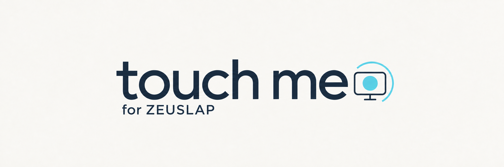

[English](README.md) · [한국어](README.ko.md) · [Source](https://github.com/soom-kang/touch-me)

# Touch Me Homebrew Tap

Touch Me is a menu bar app that helps you use ZEUSLAP touchscreen input properly on a Mac. This repository is a personal Homebrew Tap for installing and updating the Touch Me beta, maintaining the release version, download URL and file verification information.

The current beta targets Apple Silicon Macs running macOS 26 (Tahoe) or later and requires the USB/HID profile verified on the P16KT. Compatibility with other ZEUSLAP models has not been verified. The app starts in English, with Korean available in settings.

## Install

If you already installed `/Applications/Touch Me.app` manually, turn off **Launch at login**, select **Stop mapping**, confirm the device mode was restored, then **Quit** normally. Preserve the old app outside Applications before continuing. Keep its saved preferences; do not force an overwrite.

```bash
brew install --cask soom-kang/touch-me/touch-me
```

Release `0.8.0-beta.2` uses ad hoc signing without a Developer ID signature or Apple notarization. Verify the [release source and checksum](https://github.com/soom-kang/touch-me/releases/tag/v0.8.0-beta.2) before first launch. macOS may block the app. When available, follow [Apple's manual approval procedure](https://support.apple.com/en-us/102445) in **System Settings → Privacy & Security → Open Anyway**. A damage/malware alert or managed policy may require investigation; approval and execution are not guaranteed.

Allow **Input Monitoring** and **Accessibility** in System Settings, then refresh the app. Updates may require renewed approval; check both permissions before mapping. The Cask does not grant permissions or remove quarantine.

## Update or remove

Before either operation, select **Stop mapping**, confirm device-mode restoration, then **Quit** normally. If restoration fails, stop the operation, reconnect the P16KT to the same USB port and retry Stop. Do not continue until restoration succeeds.

```bash
brew update
brew upgrade --cask soom-kang/touch-me/touch-me
```

To remove the app, turn off **Launch at login** first, complete the same Stop/Quit sequence, then run:

```bash
brew uninstall --cask soom-kang/touch-me/touch-me
```

Removal preserves saved preferences. There are no launch hooks, process-kill hooks, permission changes or `zap` routine.

## Maintain this Tap

Beta versions are updated manually. Keep the Cask version, versioned release URL and SHA-256 together. Update `audit_exceptions/github_prerelease_allowlist.json` to the exact intended beta version; it permits that prerelease without disabling other ordinary audit checks.

Follow the [release runbook](https://github.com/soom-kang/touch-me/blob/main/docs/Homebrew.md) for publication and audit. Audit results do not establish installation, Gatekeeper approval, GUI behavior, physical-device mapping or login launch. See the [app guide](https://github.com/soom-kang/touch-me#readme) for use and support limits.

[MIT License](LICENSE), copyright 2026 Soom Kang.
